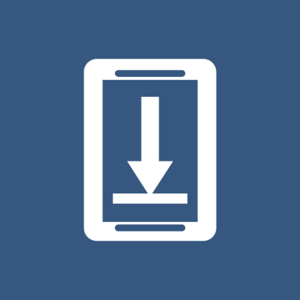

#  Save On Device

an Android app that allows you to save files on your device from other apps using the share functionality.

## Features
- Save files from other apps to local storage
- Save copied text to local storage

## Download

## License

    Copyright 2023 Landan Jackson

    Licensed under the Apache License, Version 2.0 (the "License");
    you may not use this file except in compliance with the License.
    You may obtain a copy of the License at

    http://www.apache.org/licenses/LICENSE-2.0

    Unless required by applicable law or agreed to in writing, software
    distributed under the License is distributed on an "AS IS" BASIS,
    WITHOUT WARRANTIES OR CONDITIONS OF ANY KIND, either express or implied.
    See the License for the specific language governing permissions and
    limitations under the License.
